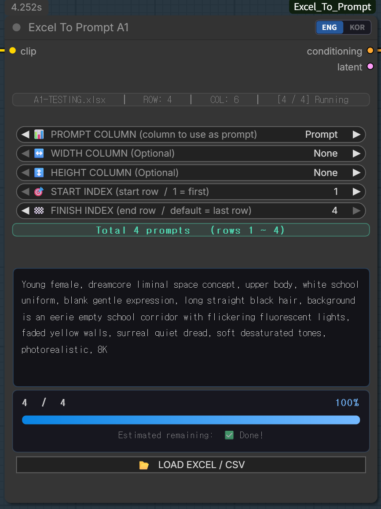
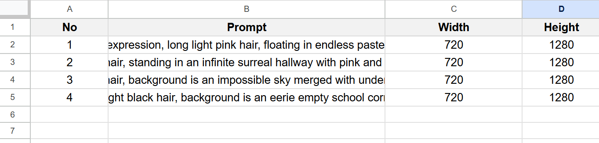
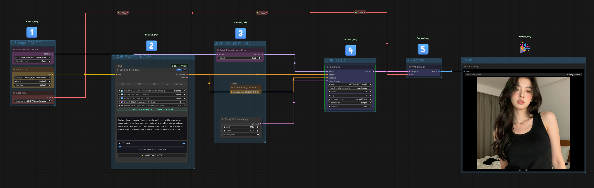

# ComfyUI — Excel To Prompt

> **Select your language / 언어를 선택하세요**
>
> 
> 

---

## 🔗 Community & Support

> 💬 Join the community, share your work, and support the project!  
> 커뮤니티에 참여하고, 작업을 공유하고, 프로젝트를 응원해주세요!

| Platform | Link |
|----------|------|
| 🎬 YouTube | [youtube.com/@A01demort](https://www.youtube.com/@A01demort) |
| 🎨 Civitai | [civitai.com/user/a01demort](https://civitai.com/user/a01demort) |
| 💬 Discord | [discord.gg/zdQrpU24NE](https://discord.gg/zdQrpU24NE) |
| 🟡 KakaoTalk | [open.kakao.com/o/gxvpv2Mf](https://open.kakao.com/o/gxvpv2Mf) |

---

---

# 🇺🇸 English Version

---

## What is Excel To Prompt?

**Excel To Prompt** is a custom node for ComfyUI that lets you load prompts stored in an **Excel (`.xlsx`) file** or a **CSV file** directly into your generation workflow.

If you don't have Microsoft Excel, you can use **Google Sheets** and export it as `.xlsx` or `.csv`.

---

## 📦 Node Overview

  

---

## 📊 Excel / CSV File Structure

Your spreadsheet can have any column names you like — there is **no strict format**.  
However, it is recommended to use the **first row as a header row** for easy identification.

- The **first row** is treated as a header and is **automatically skipped** during processing.
- Recommended first-row labels: `Prompt`, `Width`, `Height`, or any name that helps you identify the column.

  

> **Tip:** After loading with **Load Excel or CSV**, you can instantly see how many rows and columns were detected.

---

## 🚀 Method 1 — Simple Prompt Only

Use this method when you only need to cycle through **prompts** with a fixed image size (set in an Empty Latent node).

### Steps

1. Prepare your Excel or CSV file with at least one column containing your prompts.
2. In ComfyUI, press **Load Excel or CSV** to select your file.
3. In the **Excel To Prompt A1** node, find the **Prompt Column** dropdown and select your prompt column.
4. Adjust **Start Index** and **Finish Index** if you want to begin from a specific row or limit to a certain range.
   - By default, Start = first row, Finish = last row.
5. Set your desired resolution in the **Empty Latent** node.
6. Queue the workflow — prompts will change automatically for each image!

  

> **Note:** Start Index and Finish Index are useful when you want to resume from the middle, or process only a specific range of rows.

---

## 🖼️ Method 2 — Prompt + Width & Height from Excel

Use this method when you have **Width** and **Height** values stored in your Excel file, so each prompt gets its own custom resolution automatically.

### Steps

1. Add `Width` and `Height` columns to your Excel file with the desired pixel values per row.
2. In the **Excel To Prompt A1** node, select:
   - Your **Prompt Column**
   - Your **Width Column**
   - Your **Height Column**
3. Connect the **Latent output** of the node to the **KSampler's Latent input** (instead of Empty Latent).
4. Queue the workflow — each prompt will now be generated at its own specified resolution!

  

> No more manual resizing between prompts — everything is handled automatically per row.

---

## 📋 License

This project is licensed under the **MIT License**.

---

Made with ❤️ by A1 (a01demort)

---
---

# 🇰🇷 한국어 버전

---

## Excel To Prompt란?

**Excel To Prompt**는 ComfyUI용 커스텀 노드로, **엑셀(`.xlsx`) 파일** 또는 **CSV 파일**에 저장된 프롬프트를 이미지 생성 워크플로우에 바로 불러올 수 있습니다.

Microsoft Excel이 없다면 **Google 스프레드시트**를 활용해 `.xlsx` 또는 `.csv`로 내보내도 됩니다.

---

## 📦 노드 소개

  

---

## 📊 엑셀 / CSV 파일 구조

스프레드시트의 열 이름은 **자유롭게 지정**하셔도 됩니다 — 정해진 양식은 없어요.  
다만 **첫 번째 행은 헤더(구분용)** 로 사용하는 것을 추천합니다.

- **1행(첫 번째 행)** 은 헤더로 인식되어 **자동으로 건너뜁니다**.
- 첫 번째 행에는 `Prompt`, `Width`, `Height` 처럼 내용을 알기 쉬운 이름을 써두는 게 좋아요.

  

> **팁:** **Load Excel or CSV** 버튼을 누른 후 파일을 선택하면 현재 몇 열, 몇 행인지 바로 확인할 수 있습니다.

---

## 🚀 사용법 1 — 프롬프트만 사용하기 (Simple)

이미지 크기는 Empty Latent 노드에서 고정해두고, **프롬프트만 자동으로 바꾸고 싶을 때** 사용하는 방법입니다.

### 사용 순서

1. 프롬프트가 담긴 열이 하나 이상 있는 엑셀 또는 CSV 파일을 준비합니다.
2. ComfyUI에서 **Load Excel or CSV** 버튼을 눌러 파일을 선택합니다.
3. **Excel To Prompt A1** 노드의 **Prompt Column** 드롭다운에서 프롬프트가 들어있는 열을 선택합니다.
4. 특정 행부터 시작하거나 특정 구간만 쓰고 싶다면 **Start Index**와 **Finish Index**를 조절합니다.
   - 기본값은 첫 번째 행 ~ 마지막 행으로 자동 설정됩니다.
5. **Empty Latent** 노드에서 원하는 이미지 해상도를 설정합니다.
6. 워크플로우를 실행하면 — 프롬프트가 행마다 자동으로 바뀌면서 이미지가 생성됩니다!

  

> **참고:** Start Index와 Finish Index는 중간부터 재개하거나 특정 범위만 처리할 때 유용합니다.

---

## 🖼️ 사용법 2 — 프롬프트 + Width / Height 함께 사용하기

엑셀 파일에 **Width(가로)**와 **Height(세로)** 값도 함께 저장해두었을 때 사용하는 방법입니다.  
프롬프트마다 해상도가 달라도 매번 수동으로 바꿀 필요 없이 한 번에 처리할 수 있습니다.

### 사용 순서

1. 엑셀 파일에 `Width`와 `Height` 열을 추가하고 각 행마다 원하는 픽셀 값을 입력합니다.
2. **Excel To Prompt A1** 노드에서 다음을 선택합니다:
   - **Prompt Column** (프롬프트 열)
   - **Width Column** (가로 해상도 열)
   - **Height Column** (세로 해상도 열)
3. 노드의 **Latent 출력**을 **Empty Latent 대신 KSampler의 Latent 입력에 연결**합니다.
4. 워크플로우를 실행하면 — 각 프롬프트가 설정된 해상도에 맞게 자동으로 생성됩니다!

  

> 매번 직접 해상도를 바꿔줄 필요 없이 엑셀 데이터 기반으로 자동 처리됩니다.

---

## 📋 라이선스

이 프로젝트는 **MIT 라이선스** 하에 배포됩니다.

---

Made with ❤️ by A1 (a01demort)

